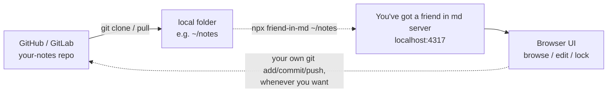

# You've got a friend in md (and csv)

Let's write files that are easy for AI to read — and become better friends
with AI!

Point it at any folder of markdown (and csv) files (nested folders preserved),
browse and edit them in a rich WYSIWYG editor right in the browser, and search
across the whole tree. Files default to **locked** (read-only) — unlock one
explicitly before editing, then lock it again when you're done.

## Features

- **WYSIWYG editing** — powered by [Milkdown](https://milkdown.dev)/Crepe. The
  editor is always in rendered form, not raw markdown text. Hover the left
  edge of any block for a **+** menu to insert headings, lists, tables, code
  blocks, quotes, and more.
- **Lock / Unlock** — every file starts locked. Click **Unlock** to make it
  editable, **Save** to write changes to disk, **Lock** to make it read-only
  again.
- **CSV editing** — csv files show up in the folder browser too, as an
  editable spreadsheet-style grid (add/remove rows and columns). Same
  lock/unlock/save flow as markdown. Files larger than 2 MB are shown in the
  tree but blocked from opening, so a huge CSV can't lock up the browser.
- **Search** — searches file names and file contents across every markdown and
  csv file under the selected folder, however deeply nested. Click a result to
  jump straight to that file.
- **Native folder picker** — "Browse for folder…" opens your OS's real folder
  dialog (Explorer / Finder / GTK), so you don't have to type a path. Works
  from Windows, macOS, Linux, and WSL2 (see below).
- **Diagrams (Mermaid / PlantUML)** — fenced code blocks written as
  ` ```mermaid ` or ` ```plantuml ` render as live diagrams right in the
  editor. Each rendered diagram gets its own toolbar:
  - **Download PNG** — saves the diagram as a raster image, for both Mermaid
    and PlantUML diagrams.
  - **Download SVG** — Mermaid only. Mermaid renders entirely in your browser,
    so its SVG is trustworthy to save as-is. PlantUML source is instead sent
    to the public `plantuml.com` rendering server (proxied through the
    You've got a friend in md server, with `kroki.io` as a fallback) to come
    back as SVG — since that SVG is unsanitized third-party output,
    You've got a friend in md only offers the rasterized PNG download for it,
    not the raw SVG. Don't put sensitive diagram content in PlantUML blocks if
    that matters to you.
  - **Fullscreen** — expands the diagram to fill the screen (native browser
    fullscreen, `Esc` to exit).
- **Insert image from folder** — while editing, the **🖼 Insert image**
  toolbar button opens a browser scoped to your notes folder. Navigate into
  subfolders and click an image to insert it. The markdown file itself keeps
  an ordinary relative path (e.g. ``), so it stays
  readable in any other markdown tool — You've got a friend in md just
  resolves that path to display the image live while you edit.

## How it fits into your workflow

You've got a friend in md is a standalone tool, not something that lives
inside your notes repo. Your markdown notes stay in their own git repository
on GitHub/GitLab (or nowhere at all — git is optional);
You've got a friend in md just points at whatever local folder that repo
happens to be cloned into.



- The **notes repo** and the **You've got a friend in md tool** are two
  completely separate things — different repos, different lifecycles.
- You've got a friend in md doesn't need your notes folder to be a git repo at
  all; if it is one, committing/pushing back to GitHub/GitLab is still
  entirely up to you and your normal git tooling, outside of
  You've got a friend in md.

## Usage

```bash
npx friend-in-md
```

No clone, no `npm install` step — `npx` fetches the package from the npm
registry and runs it. Opens a local server (default `http://127.0.0.1:4317`)
and your browser. If you don't pass a folder, pick one from the in-browser
folder picker; you can also launch straight into a folder:

```bash
npx friend-in-md ~/notes
```

Options:

- `--port <n>` — port to listen on (default `4317`). If that port is already
  taken (e.g. by another app or Docker container), You've got a friend in md
  automatically tries the next port up instead of failing.
- `--no-open` — don't auto-open the browser
- `--verbose` — print raw per-request logs (method, status, timing) in
  addition to the normal friendly log. Off by default: everyday use only
  prints short emoji lines like "📄 Opened file: notes.md" for what you
  actually did (open/save/lock/search/etc).

## Try it: a hands-on tutorial with `test_md/`

This repo ships a `test_md/` folder with a sample `test.md` containing Mermaid
and PlantUML diagrams, so you can try the diagram/image features without
setting up your own notes first. This step needs a clone of the repo (the
`test_md/` folder isn't published in the npm package) — everyday usage against
your own notes only needs `npx friend-in-md <dir>`, no clone.

1. Start You've got a friend in md pointed at the sample folder:

   ```bash
   npx friend-in-md test_md
   ```

2. In the file tree on the left, click **test.md**. It opens **locked**
   (read-only) — you'll see two Mermaid diagrams (a flowchart and a sequence
   diagram) and two PlantUML diagrams (a class diagram and a sequence diagram)
   already rendered.
3. Hover a diagram and try its toolbar:
   - Click **Fullscreen** to expand it, `Esc` to leave fullscreen.
   - Click **Download PNG** to save it as a file (the Mermaid one also offers
     **Download SVG**).
4. Click **Unlock** in the top toolbar to make the file editable. Each
   diagram's code block now shows the raw Mermaid/PlantUML source above the
   rendered preview — edit a line (e.g. change a label in the flowchart) and
   watch the diagram re-render automatically after a short pause.

5. Try image insertion: click **🖼 Insert image** in the toolbar. Since
   `test_md/` has no images yet, first drop an image file (e.g. `logo.png`)
   into the `test_md/` folder on disk, then reopen the picker — it'll show
   up and clicking it inserts it at the cursor.
6. Click **Save** to write your changes to `test_md/test.md`, then **Lock**
   to make it read-only again.

## How locking works

- Every file starts **locked** (read-only) by default.
- **Unlock** — makes the file editable.
- Edit, then **Save** — writes the change to disk.
- **Lock** — makes it read-only again, to guard against accidental edits.