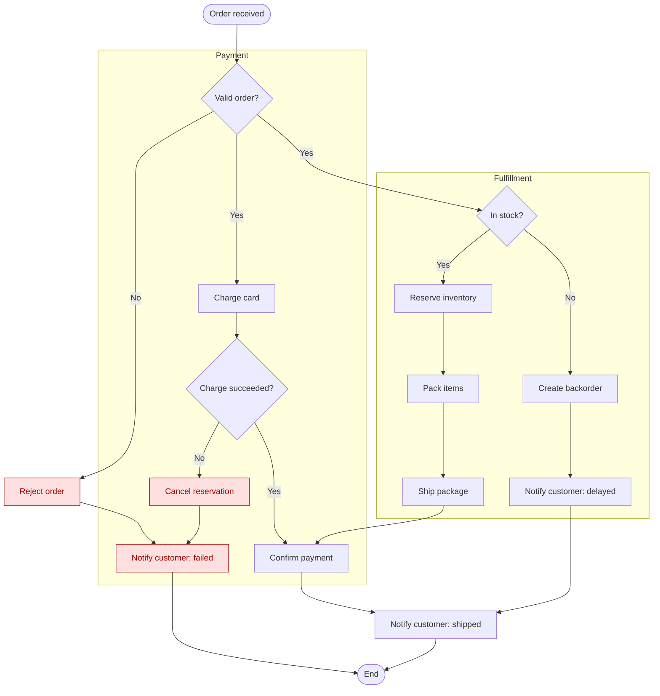
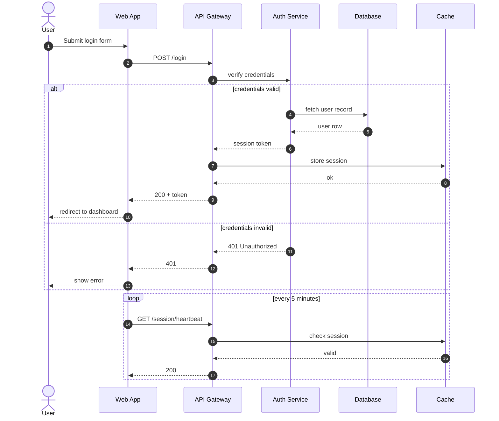
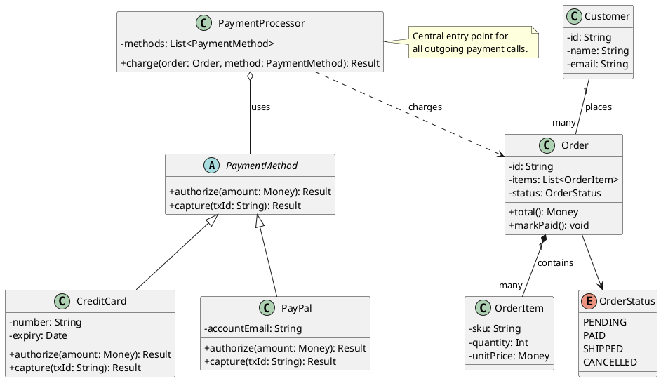
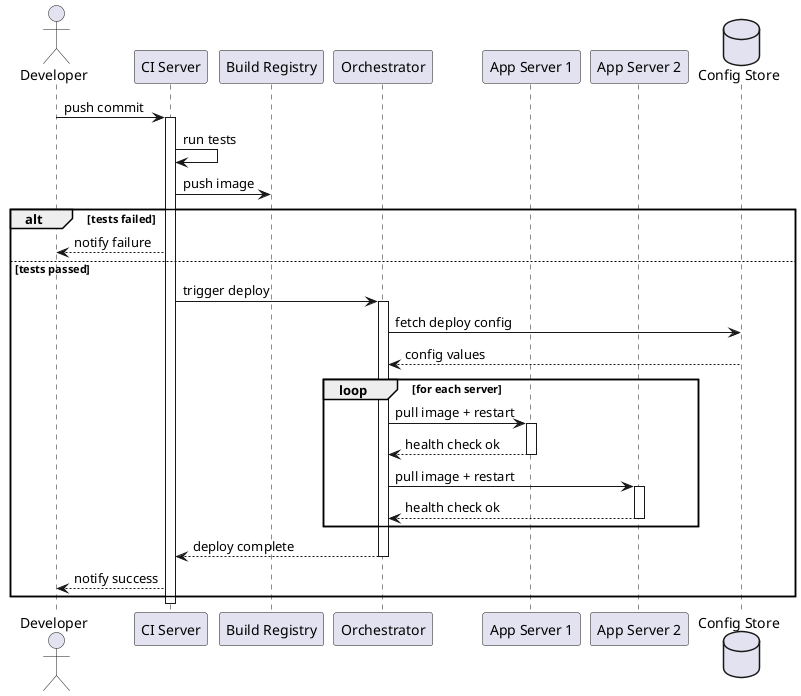

# Diagram test

## Mermaid: order processing flow

```mermaid
flowchart TD
    Start([Order received]) --> Validate{Valid order?}
    Validate -- No --> Reject[Reject order]
    Reject --> NotifyFail[Notify customer: failed]
    NotifyFail --> End([End])

    Validate -- Yes --> CheckStock{In stock?}

    subgraph Fulfillment
        CheckStock -- No --> Backorder[Create backorder]
        Backorder --> NotifyDelay[Notify customer: delayed]
        CheckStock -- Yes --> Reserve[Reserve inventory]
        Reserve --> Pack[Pack items]
        Pack --> Ship[Ship package]
    end

    subgraph Payment
        Validate -- Yes --> Charge[Charge card]
        Charge --> ChargeOk{Charge succeeded?}
        ChargeOk -- No --> Refund[Cancel reservation]
        Refund --> NotifyFail
        ChargeOk -- Yes --> Confirm[Confirm payment]
    end

    Ship --> Confirm
    Confirm --> NotifySuccess[Notify customer: shipped]
    NotifyDelay --> NotifySuccess
    NotifySuccess --> End

    classDef fail fill:#ffe0e0,stroke:#a30000,color:#a30000;
    class Reject,NotifyFail,Refund fail;
```

## Mermaid: request sequence

```mermaid
sequenceDiagram
    autonumber
    actor User
    participant Web as Web App
    participant API as API Gateway
    participant Auth as Auth Service
    participant DB as Database
    participant Cache as Cache

    User->>Web: Submit login form
    Web->>API: POST /login
    API->>Auth: verify credentials

    alt credentials valid
        Auth->>DB: fetch user record
        DB-->>Auth: user row
        Auth-->>API: session token
        API->>Cache: store session
        Cache-->>API: ok
        API-->>Web: 200 + token
        Web-->>User: redirect to dashboard
    else credentials invalid
        Auth-->>API: 401 Unauthorized
        API-->>Web: 401
        Web-->>User: show error
    end

    loop every 5 minutes
        Web->>API: GET /session/heartbeat
        API->>Cache: check session
        Cache-->>API: valid
        API-->>Web: 200
    end
```

## PlantUML: class diagram

```plantuml
@startuml
skinparam classAttributeIconSize 0

abstract class PaymentMethod {
  +authorize(amount: Money): Result
  +capture(txId: String): Result
}

class CreditCard {
  -number: String
  -expiry: Date
  +authorize(amount: Money): Result
  +capture(txId: String): Result
}

class PayPal {
  -accountEmail: String
  +authorize(amount: Money): Result
  +capture(txId: String): Result
}

PaymentMethod <|-- CreditCard
PaymentMethod <|-- PayPal

class Order {
  -id: String
  -items: List<OrderItem>
  -status: OrderStatus
  +total(): Money
  +markPaid(): void
}

class OrderItem {
  -sku: String
  -quantity: Int
  -unitPrice: Money
}

class Customer {
  -id: String
  -name: String
  -email: String
}

enum OrderStatus {
  PENDING
  PAID
  SHIPPED
  CANCELLED
}

class PaymentProcessor {
  -methods: List<PaymentMethod>
  +charge(order: Order, method: PaymentMethod): Result
}

Order "1" *-- "many" OrderItem : contains
Customer "1" -- "many" Order : places
Order --> OrderStatus
PaymentProcessor o-- PaymentMethod : uses
PaymentProcessor ..> Order : charges

note right of PaymentProcessor
  Central entry point for
  all outgoing payment calls.
end note
@enduml
```

## PlantUML: deployment sequence

```plantuml
@startuml
actor Developer
participant "CI Server" as CI
participant "Build Registry" as Registry
participant "Orchestrator" as Orch
participant "App Server 1" as App1
participant "App Server 2" as App2
database "Config Store" as Config

Developer -> CI : push commit
activate CI

CI -> CI : run tests
CI -> Registry : push image

alt tests failed
  CI --> Developer : notify failure
else tests passed
  CI -> Orch : trigger deploy
  activate Orch

  Orch -> Config : fetch deploy config
  Config --> Orch : config values

  loop for each server
    Orch -> App1 : pull image + restart
    activate App1
    App1 --> Orch : health check ok
    deactivate App1

    Orch -> App2 : pull image + restart
    activate App2
    App2 --> Orch : health check ok
    deactivate App2
  end

  Orch --> CI : deploy complete
  deactivate Orch
  CI --> Developer : notify success
end
deactivate CI
@enduml
```
